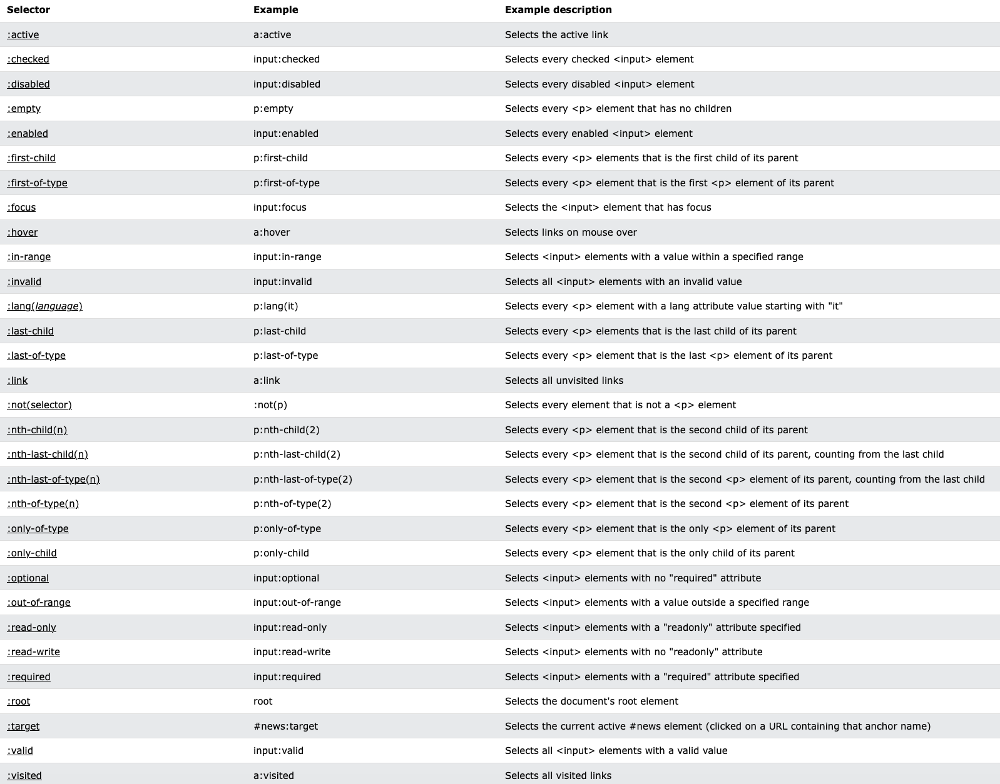
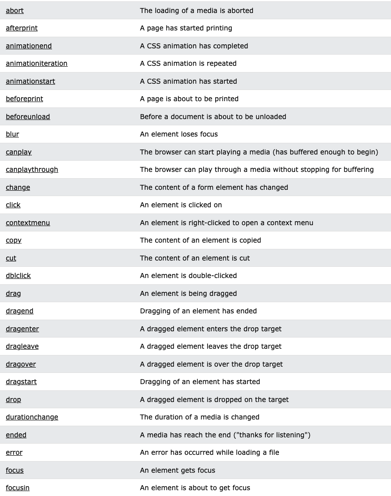
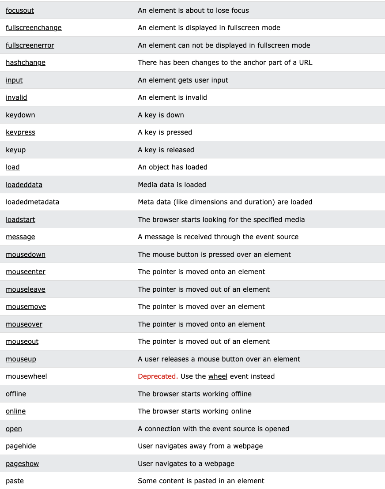
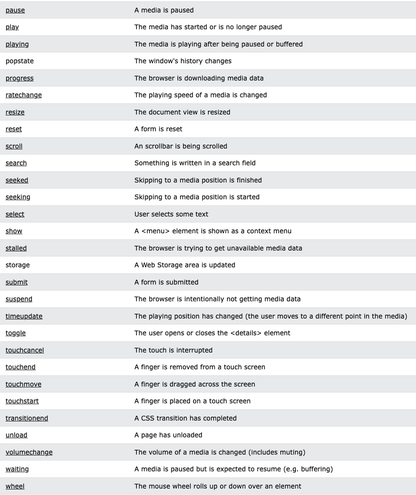

# EKSAMEN IT2805

## Introduction
#### Webarchitecture

Server-client relationship, Cloud, Network

#### The Internet
TCP/IP, OSI-model: application (HTTP, FTP, SSH), transport (TCP, UDP), network (IP), data link (ethernet, WiFi), physical, Domains and DNS, Routing, WWW,

## Document Object Model
Programming interface for HTML an XML. A web page is a document, which can be displayed in the browser, the HTML file itself or as a document tree. This HTML file:
```
<!DOCTYPE html>
<html>
<head>
	<meta charset="utf-8">
	<meta name="viewport" content="width=device-width, initial-scale=1">
	<title></title>
</head>
<body>

</body>
</html>
```
Would give a document tree with a HTML root consisting of two branches, head and body.

## HTML
This "<...>" is called a tag, while this "<...></...>" is called an element. HTML code are the characters inside the angled brackets.

#### Document structure
- Document declaration: ```<!DOCTYPE html>``` to inform the browser to read the doc as a HTML5 page
- ```<html>```: encloses everything. all code should be written within these tags. children: <head> and <body>
- ```<head>```: contains information about the website. not visible on website. children: <link>, <meta> and <title> 
- ```<body>```: everything inside browser window. child elements are often eiter *inline* or *block* elements, depending on ```display```. 
- 	*block*: start on a new line and takes up the full width available, e.g. ```<div>```, ```<h1 - h6>```, ```<p>```, ```<form>```
- 	*inline*: does not start on a new line and takes up as much width as necessary, e.g. ```<span>```, ```<a>```, ``````

#### Attributes 
- Provides additional information about the content of an element, e.g. ```<p lang="no">Et element med norsk tekst</p>```
- Helps browsers render elements correctly

#### Text
- Headings: ranges from h1 - h6, where h1 are the most important and biggest and h6 is the least important and smallest. convention: one h1 pr page, otherwise h2. not lower level headings to decrease size, but CSS font-size.
- Paragraphs: block of text. block element
- Special markup: boldline (```<b>```), italic (```<i>```), superscript and subscriptline breaks (```<sup/sub>```), white space collapsing, line breaks (```<br>```).

#### Lists
- ordered: ```<ol>```
- unordered: ```ul>```
- use ```<li>```-elements inside. can have lists within lists.

#### Links:
- ```<a href=""></a>```: everything inside the tags are clickable. href --> URL.
- Absolute URLs: other site
- Relative URLs: within our site
- Specific part of page ```href="#...```--> ```id="..."```
- New tab: ```target="_blank"```
- E-mail links: ```<a href="mailto:example@email.com">E-mail example</a>```

#### Images
- ``````
- good practice to specify size
- inline element
- when using img: right format (JPG, GIF, PNG), right size, measure in px
- formats: lossless - smaller but quality still OK, lossy - smaller and quality bad
- JPG (Joint Photographic Experts Group): lossy format, best for pictures
- PNG (Portable Network Graphics): lossless, best for logos and graphics, can alter transparency
- GIF (Graphic Interchange Format): limited of colors, bad for photos with high resolution. good for animations, bad for everything else.
- SVG (Scalable Vector Graphics): vector format, can scal indefinitely without loosing quality. good for logos, graphics and animations, bad for everything else.

#### Video (same concept with audio)
```
<video src="" controls (gives user access to video controls)>
	<p> Your browser doesn't support HTML5 video.</p>
</video>
<video controls>
	<source src="...mp4" type="video/mp4">
	<source src="...ogg" type="video/ogg">
	<p> Your browser doesn't support HTML5 video.</p>
</video>
```
other attributes: ```autoplay```, ```height```, ```width```, ```loop```, ```muted```, ```poster```


#### Table
```
<table>                                                  <table>
	<tr>                                                     <tr>
		<th>First name</th>					<th scope="row">First name</th>
		<th>Last name</th>		 			<td>Admin</th>
		<th>Age</th>					 </tr>
	</tr>							 <tr>
	<tr>								<th scope="row">Last name</th>
		<td>Admin</td>                                          <td>Johansen</td>
		<td>Johansen</td>                                </tr>
		<td>69</td>                                      <tr>
	</tr>                                                           <th scope="row">Age</th>
</table>                                                                <td>69</td>
								 </tr>
							</table> 
```

#### Forms and validation
- ```<form action="URL for data to be sent" method="GET/POST"></form>```
- ```<fieldset>```: grouping elements with same purpose
- ```<legend>```,
- ```<label for="id">``` (describing what the content for the form element should be),
- ```<input id="id" name="id" type="text/email/password/checkbox/radio/file/date/number/tel/textarea accept="e.g. '.jpg, .png, .wav' or 'image/*'" value="" tabindex="" placeholder="" step="" min="" max="" maxlength="" pattern="RegEx" autofocus autocomplete checked (default) multiple required>```
- ```<select>```
- ```<output>``` (calculates with the given inputs) and

Validate by using correct ```type```s . Use CSS and pseudo-classes to enlighten to user. 

#### Semantic elements
- Header: ```<header>```
- Footer: ```<footer>```
- Section: ```<section>```
- Article: ```<article>```
- Nav: ```<nav>```, used in header
- Input: ```<input>```, button, file, password, submit
- Output: ```<output>```
- Figure: ```<figure><figcaption></figcaption></figure>```
- Strong: ```<strong>```
- Em: ```<em>```
- Quotes: ```<blockquote/q cite="">```
- Address: ```<address><a href=""></a></address>```, can be used with article to adress author


#### Site structure
- URL: used to link to another document or resource. follows a protocol. "http://" --> protocol, "www.example.com" --> domain
- GET: request data, not manipulate data on server side, cached, browser history, can be hacked, length restrictions
- POST: submit data, update data on server side, separate message (not in URL), never cached, not browser history, no max length
- Site map --> Storyboard


## CSS
Think of each element as a box

#### Cascade
Order of precence: 
- The last rule
- Specifity (inline, IDs, classes and pseudo-classes, elements and pseudo-elements)
- Important
- Level of styles: inline style (in tag), embedded styles (inside ```<style>```-element [in head]), external style sheet, user specified styles and browser default.
  
  Inline style highest precedence --> browser default lowest precedence

#### Other things to remember
- Inheritance: if said in the parent element, all children will follow unless other is specified.
- Selectors: ```#id```, ```.class```, ```element```, ```*```, ```li  > a``` (all links inside list), ```p a``` (any link inside a paragraph), ```h1+p``` (first paragraph after h1), ```h1~p``` (all paragraphs after h1)
- Color: can be specified using hex codes (```#XXXXXX```), color names (```red```) or RGB values (```rgb[a](x, y, z, [opacity])```)
- Margin: space between border and neighbours
- Padding: space between content and border
- Centering elements: ```margin-left:auto``` and ```margin-right:auto```
- Border: ```border-style```(e.g. none, hidden, dotted, dashed, solid, double), ```border-color``` and ```border-width```

#### Text
- typeface: serif (e.g. times new roman), sans-serif (e.g. arial), monospace (e.g. courier)
- weight: light, medium, regular, bold and black
- style: normal, *italic*, or **oblique**
```
.task1:hover OR a:first-child:hover{color: green; font-size: 22px;} // Spesific link
i:first-of-type{background-color: yellow;} // First italics
a::before{content: url(smiley.gif)} // Smiley before link
div:last-child p OR a[href$=".php"]{background: yellow} // Background of link with php extension
a:active{border: 1px solid black} // All active links
```
#### Pseudo-classes 


#### Styling lists
- ```<ul>: list-style-type: none, disc, circle, square, url()```
- ```<ol>: list-style-type: decimal, decimal-leading-zero, lower-alpha, upper-alpha, lower-romar, upper-roman, u```
- ```list-style-position: outside, inside```

#### Properties
- ```display```: inline, block, inline-block (flow like inline, keeping other block-level features), none ("removes" element)
- ```visibility```: hidden (makes element invisible), visible (default visible), collapse (table thing), initial (default), inherit (what parent has)
- ```position```: static (follows html code), relative (same as static, but can move element relative to where it originally was [top, left, right, bottom]), fixed (places relative to the viewport, always visible), absolute ("removes" element from document flow, everything else renders as if there is no element there. can be placed as relative to next parent element with a position property), sticky (relative until it reaches the top, e.g. navbar)
- ```overflow```: visible (default/"overwrites"), hidden (clipped), scroll (scrollbar), auto (depends on user agent), clip

#### Responsive web design

```
@media all/screen/print (expression) and/not/only (expression){
	element {
		proptery: value;
	}
}
```
-```<expression>```: width, height, device-width, device-height, orientation, aspect-ratio, device-aspect-ratio, color, color-index, monochrome, resolution, scan, grid


## JavaScript
- Data types: string, number, boolean
- Aritmetics: addition (+), subtraction (-), multiplication (*), division (/), modulo (%)
- Log ops: ```<```, ```<=```, ```>```, ```>=```, ```==```, ```===```, ```!=```, ```!==```, ```&&```, ```||```, ```!```
- Variables: ```var``` (function-scoped and allows re-declaration), ```let``` (block-scoped), ```const``` (block-scoped and doesn't allow re-delaration)
- Conditions and loops: ```if```, ```while```, ```for```, ```break```, ```continue```
- Objects:
  ```
	const movie = {
		title: "Bruno",
		director: "Larry Charles",
		releaseDate: 2009
  	}

  	console.log(movie.title/movie["title"]) // logs title to console 
  	movie.genre = "documentary" // creates new property
  ```
- Functions:
  ```
  	var lolz = function() {
		return "loser"
  	}
  
  	function lolz() {
		return "loser"
  	}

  	console.log(lolz())
  ```
  

#### JSON
```
	JSON.stringify(movie) -> "{title: "Bruno", director: "Larry Charles", releaseDate: 2009, genre: "documentary"}"
	const movieJSON = JSON.stringify(movie)
 	console.log(JSON.parse(movieJSON).title) 
```

#### Arrays
- ```.filter(item => item === criteria)```: removes everything that doesn't fulfill a given criteria
- ```.map(item => item.transformation())```: makes it possible to transform elements
- ```.some(item => item condition)```: returns whether the condition is true or not for some of the elements
- ```.every(item => item condition)```: returns whether the condition is true or not for every element
- ```.forEach(item => item action)```: do something with each of the elements

#### Time
- Timeout: ```setTimeout(() => {alarm(), 60000})```
- Interval: ```setInterval(() => {alarm(), 60000})```

## DOM
#### Selecting
```const item = document.selector(...)```
Selectors:
- ```.querySelector('...')```: selects first with given input
- ```.querySelectorAll('...')```: selects all with given input
- ```.getElementById('id')```: selects element with specified id
- ```.getElementByClassName('classname')```: selects element with specified classname
- ```.getElementByName('name')```: selects element with name
- ```.getElementByTagName('tag')```: selects element with specified tag name

#### Modifying
```const item = document.selector(...)```

```item[].innerText = "...";```


#### Adding
```const parentItem = document.selector(...)```

```const item = document.createElement(...)```

```item.innerText = ""```

```parentItem.appendChild(item)```


#### Removing
```const parentItem = document.selector(...)```

```const item = parentItem.firstChild```

```parentItem.removeChild(item)```

#### Events
```const item = document.selector(...)```

```item.addEventLister('event', (event) => {do this})```

Eventlisteners:
<div>
	
	
	
</div>


## Example tasks
```
<html>
<head>
    <style>
        #correct{display: none;}
        #incorrect{display: none;}
    </style>
</head>
<body>
    Email: <input type="text" id = "mail"> </input> <br>
    
    
    <script>
        let email = document.getElementById("mail")
        mail.addEventListener('mouseover', changeColor)
        mail.addEventListener('focus', changeColor)
        function changeColor(){
            email.style.backgroundColor = 'yellow'
        }
        mail.addEventListener('blur',validate)
        function validate(){
            if (checkCharacters() && checkBeforeAndAfter() && checkAfter()){
                document.getElementById('correct').style.display = 'inline'
                document.getElementById('incorrect').style.display = 'none'
            } else {
                document.getElementById('correct').style.display = 'none'
                document.getElementById('incorrect').style.display = 'inline'
            }
        }
        function checkCharacters(){
            let mail = email.value
            if (mail.includes(".") && mail.includes("@") ){
                return true
            } else {
                return false
            }
        }
        function checkBeforeAndAfter(){
            let mail = email.value
            let splitMail = mail.split("@")
            if(splitMail[0].length > 1 && splitMail[1].length > 1) {
                return true
            } else {
                return false
            }
        }
        function checkAfter(){
            let mail = email.value
            let splitMail = mail.split(".")
            if(splitMail[1].length > 1) {
                return true
            } else {
                return false
            }
        }
        mail.addEventListener('keyup', changeCase)
        function changeCase(){
            email.value=email.value.toUpperCase()
        }
    </script>
</body>
```
```
<body>
        <form class="form">
            <div>
                <label>First Name:</label>
                <input id="firstName" type="text">
            </div>
            <div>
                <label>Last Name:</label>
                <input id="lastName" type="text">
            </div>
            <div>
                <label>Password:</label>
                <input id="password" type="password">
            </div>
            <div>
                <label>Date of birth:</label>
                <input id="birthdate" type="date">
            </div>
            <button onclick="validate()" style="width: fit-content">Submit</button>
        </form>
    </div>
    <script>
        let firstName = document.getElementById("firstName");
        let lastName = document.getElementById("lastName");
        let password = document.getElementById("password");
        let birthdate = document.getElementById("birthdate");
        function validateName(){
            for (let i = 0; i < firstName.value.length; i++) {
                if (/[0-9]/.test(firstName.value[i])){
                    alert("First name cannot contain any numbers")
                    return false;
                }
            }
            for (let j = 0; j < lastName.value.length; j++) {
                if (/[0-9]/.test(lastName.value[j])){
                    alert("Last name cannot contain any numbers");
                    return false;
                }
            }
            return true;
        };
        function validatePassword(){
            let capitalLetter = 0;
            let specialSign = 0;
            let number = 0;
            for (let i = 0; i < password.value.length; i++) {
                if(/[0-9]/.test(password.value[i])){
                    number++;
                }
                else if (/[A-Z]/.test(password.value[i])) {
                    capitalLetter++;
                }
                else if (/[!@#$%^&*()_+\-=[\]{};':"\\,.<>\/?]/.test(password.value[i])) {
                    specialSign++;
                }
            }
            if (specialSign > 0 && number > 0 && capitalLetter > 0){
                return true
            }
            else{
                alert("Your password is not strong enough")
                return false
            }
        }
        function validateBirthday(){
            let today = new Date(); 
            let birthDate = new Date(birthdate.value);
            let yearToday = today.getFullYear();
            let yearBorn = birthDate.getFullYear();
            age = yearToday - yearBorn
            if (age < 18){
                alert("You need to be 18 years old.")
                return false
            }
            else{
                return true
            }
        }
        function validate(){
            if (validateBirthday() && validateName() && validatePassword()){
                return true;
            }
            else{
                return false;
            }
        }
        </script>
    </body>
</html>
```


